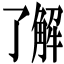
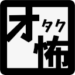
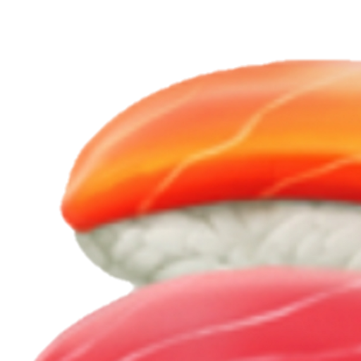
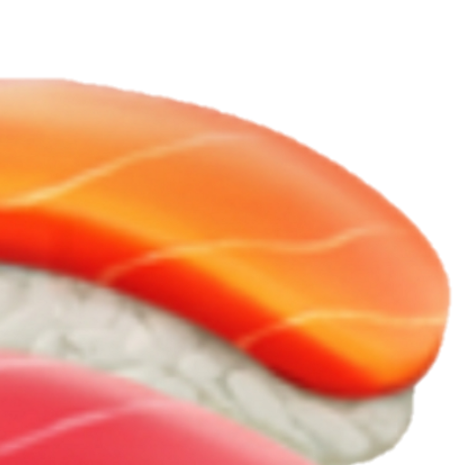
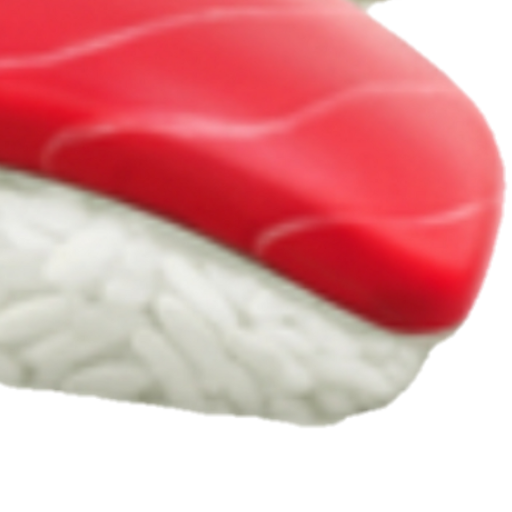

# emoji

## LICENSE

[Creative Commons Zero v1.0 Universal](LICENSE)

`:ryokai:`|`:naruhodo:`| `:koresuki:` | `:waiwai:`| `:kami:` | `:seyana:`
:-:|:-:|:-:|:-:|:-:|:-:
 |  |  |  |  |  |

`:wakaru:`|`:wakarazu:` | `:ha:`| `:saiaku:` | `:haipro:` | `harassment`
:-:|:-:|:-:|:-:|:-:|:-:
 |  |  |   |  |  |

`:kasu:`| `:hibo_chusho:` |`:mu:` |`:exclamation-w:`
:-:|:-:|:-:|:-:
 |  |  | 

 `:jinsei_shuryo:` | `:jinsei_kaishi:` | `:shakai_futekigo:` | `:mushoku:` | `okowa`
:-:|:-:|:-:|:-:|:-:
 |  |   |   |  

### sushi-2

`:sushi-upper-left:` | `:sushi-upper-rihgt:`
:-:|:-:
 | 

`:sushi-lower-left:`| `:sushi-lower-right:`
:-:|:-:
 | 

### sushi-3

`:sushi-top-left:` | `:sushi-top-center:` | `:sushi-top-right:`
:-:|:-:|:-:
 |  | 

`:sushi-middle-left:` | `:sushi-middle-center:` | `:sushi-middle-right:`
:-:|:-:|:-:
 |  | 

`:sushi-bottom-left:` | `:sushi-bottom-center:` | `:sushi-bottom-right:`
:-:|:-:|:-:
 |  | 

### sushi-6

`:sushi-6-0-0:` |`:sushi-6-0-1:` |`:sushi-6-0-2:` | `:sushi-6-0-3:` | `:sushi-6-0-4:` | `:sushi-6-0-5:` |
:-:|:-:|:-:|:-:|:-:|:-:
 |  |  |  |  | 

`:sushi-6-1-0:` |`:sushi-6-1-1:` |`:sushi-6-1-2:` | `:sushi-6-1-3:` | `:sushi-6-1-4:` | `:sushi-6-1-5:` |
:-:|:-:|:-:|:-:|:-:|:-:
 |  |  |  |  | 

`:sushi-6-2-0:` |`:sushi-6-2-1:` |`:sushi-6-2-2:` | `:sushi-6-2-3:` | `:sushi-6-2-4:` | `:sushi-6-2-5:` |
:-:|:-:|:-:|:-:|:-:|:-:
 |  |  |  |  | 

`:sushi-6-3-0:` |`:sushi-6-3-1:` |`:sushi-6-3-3:` | `:sushi-6-3-3:` | `:sushi-6-3-4:` | `:sushi-6-3-5:` |
:-:|:-:|:-:|:-:|:-:|:-:
 |  |  |  |  | 

`:sushi-6-4-0:` |`:sushi-6-4-1:` |`:sushi-6-4-2:` | `:sushi-6-4-3:` | `:sushi-6-4-4:` | `:sushi-6-4-5:` |
:-:|:-:|:-:|:-:|:-:|:-:
 |  |  |  |  | 

`:sushi-6-5-0:` |`:sushi-6-5-1:` |`:sushi-6-5-2:` | `:sushi-6-5-3:` | `:sushi-6-5-4:` | `:sushi-6-5-5:` |
:-:|:-:|:-:|:-:|:-:|:-:
 |  |  |  |  | 

